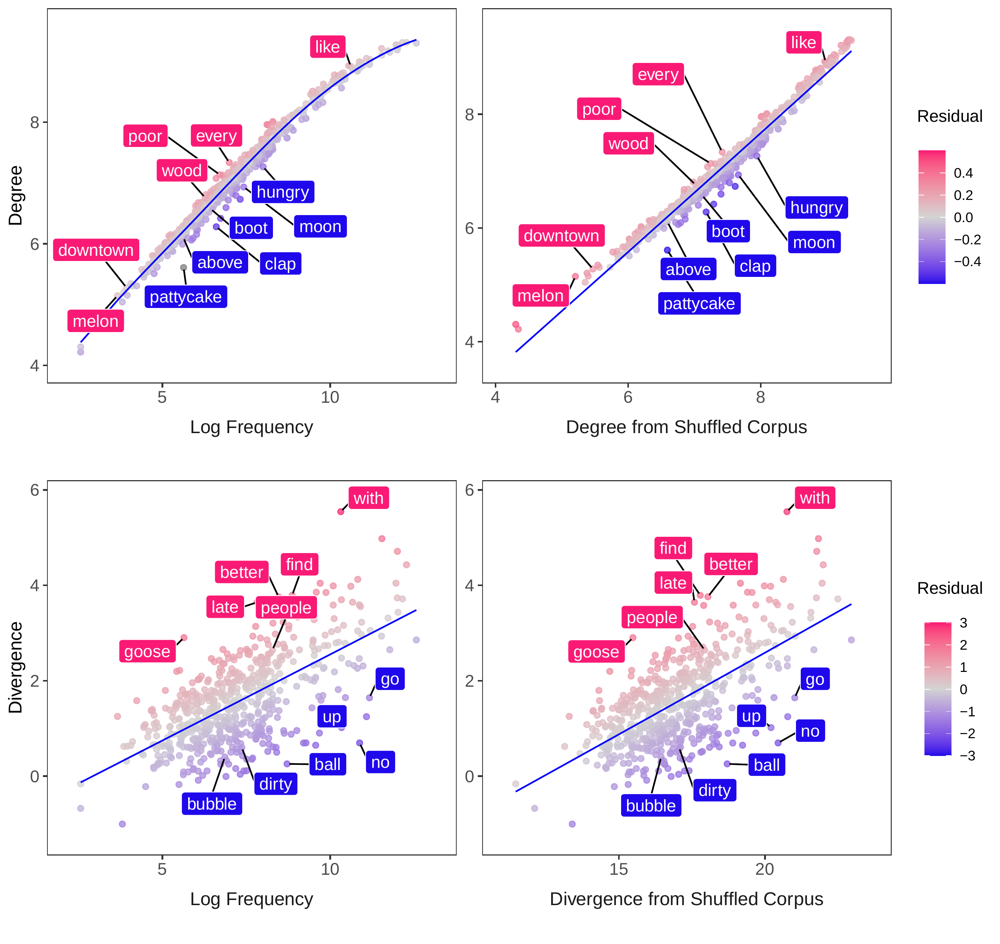

# Context-Diversity

This repository includes scripts and data for the manuscript, When is a Word in Good Company for Learning? published in *Developmental Science*.

The published manuscript can be found here: <https://doi.org/10.1111/desc.13510>

This project tackles the question: Do children learn words more easily when they hear them in a diverse range of conversational contexts (e.g., conversations about mealtime, playtime and bathtime), or consistently in the same conversational context?

Conflicting findings have led to different answers to this question in the past. This project resolves this conflict by disentangling context diversity from word frequency. Word frequency is strongly related to context diversity, as shown below, and is also an important predictor of word learning. By disentangling context diversity from frequency, we found that the conflicting findings disappeared. Across four languages, we found that words were learned more easily when they occurred consistently in the same contexts.

The analyses implement multiple measures of context diversity that have been developed in prior research, which can be found in the script "01_degree_divergence.R".

A key aspect of these analyses is to capture relationships between context diversity, frequency and word learning that are nonlinear but consistently in one direction, e.g., always positive or always negative. The analyses therefore use Generalized Additive Models implemented in the extremely useful scam package in R ( <https://doi.org/10.1007%2Fs11222-013-9448-7> ). These analyses are in the script, "02_predict_aoa.R".

The scripts have been extensively commented and are intended to be run in this order using the contents of the subfolders:

01_degree_divergence.R

02_predict_aoa.R

03_graphs_tables.R

